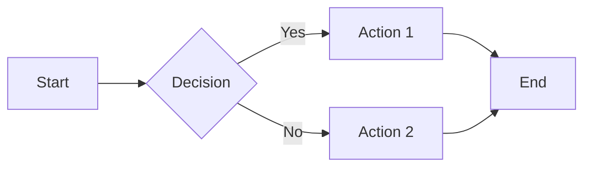
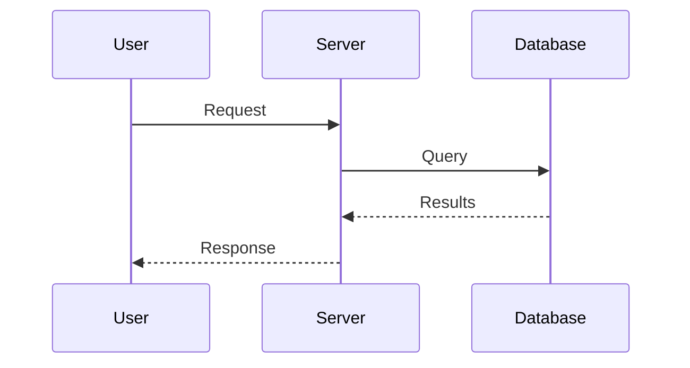

# Vite Plugins Reference

This document covers all Vite plugins configured for this VitePress site.

---

## vitepress-plugin-rss

**Purpose:** Generates an RSS feed from your blog posts automatically during build.

**Configuration:** Defined in `config.js` with `RSS_CONFIG` object.

**Output:** Creates `/feed.rss` at build time.

**Usage:** Already automatic - just write blog posts in `/blog/` folder.

---

## vite-plugin-imagemin

**Purpose:** Compresses images during build for better performance.

**Formats Supported:**
- GIF (gifsicle)
- PNG (optipng)
- JPEG (mozjpeg)
- SVG (svgo)
- WebP

**Usage:** Automatic - just add images to your project and they'll be optimized at build time.

---

## vitepress-plugin-mermaid

**Purpose:** Renders Mermaid diagrams directly in markdown.

### Example: Flowchart

~~~md

~~~


### Example: Sequence Diagram

~~~md

~~~


---

## vitepress-plugin-tabs

**Purpose:** Create tabbed content blocks for showing alternatives (e.g., different languages/frameworks).

### Syntax

~~~md
::: tabs

== Tab 1 Title

Content for tab 1

== Tab 2 Title

Content for tab 2

:::
~~~

### Example: Code in Multiple Languages

::: tabs

== JavaScript

```js
function greet(name) {
  return `Hello, ${name}!`
}
```

== Python

```python
def greet(name):
    return f"Hello, {name}!"
```

== Rust

```rust
fn greet(name: &str) -> String {
    format!("Hello, {}!", name)
}
```

:::

---

## vitepress-plugin-group-icons

**Purpose:** Adds tech stack icons next to code block filenames for visual clarity.

### Usage

Add a filename in brackets after the language:

~~~md
```js [vite.config.js]
export default {
  // config here
}
```
~~~

```js [vite.config.js]
export default {
  // config here
}
```

```ts [app.ts]
const app = express()
```

```vue [App.vue]
<template>
  <div>Hello</div>
</template>
```

---

## vite-plugin-pwa

**Purpose:** Adds Progressive Web App support - offline access, installability, and caching.

### Features Enabled

- **Auto-updating service worker** - New content loads automatically
- **Offline support** - Site works without internet after first visit
- **Installable** - Users can add to home screen on mobile/desktop
- **Asset caching** - JS, CSS, HTML, images, fonts are cached

### Manifest Configuration

```js
manifest: {
  name: 'Qiankun',
  short_name: 'Qiankun',
  theme_color: '#1a1a2e',
  background_color: '#1a1a2e',
  display: 'standalone'
}
```

### Usage

Automatic - no markdown syntax needed. The PWA is generated at build time.

---

## unplugin-icons

**Purpose:** Use any icon from [Iconify](https://icon-sets.iconify.design/) as a Vue component.

### Import Pattern

```
~icons/{collection}/{icon-name}
```

### Example Usage in Vue

```vue
<script setup>
import IconGithub from '~icons/mdi/github'
import IconVue from '~icons/logos/vue'
import IconTypeScript from '~icons/logos/typescript-icon'
import IconSearch from '~icons/lucide/search'
</script>

<template>
  <IconGithub class="icon" />
  <IconVue />
  <IconTypeScript />
  <IconSearch />
</template>

<style scoped>
.icon {
  width: 24px;
  height: 24px;
}
</style>
```

### Popular Icon Collections

| Collection | Prefix | Examples |
|------------|--------|----------|
| Material Design | `mdi` | `~icons/mdi/github`, `~icons/mdi/home` |
| Lucide | `lucide` | `~icons/lucide/search`, `~icons/lucide/menu` |
| Heroicons | `heroicons` | `~icons/heroicons/arrow-right` |
| Simple Icons (brands) | `simple-icons` | `~icons/simple-icons/github` |
| Logos | `logos` | `~icons/logos/vue`, `~icons/logos/react` |
| Carbon | `carbon` | `~icons/carbon/document` |

Browse all icons: [icon-sets.iconify.design](https://icon-sets.iconify.design/)

---

## Quick Reference

| Plugin | Purpose | Syntax/Usage |
|--------|---------|--------------|
| RSS | Blog feed | Automatic |
| Imagemin | Image compression | Automatic |
| Mermaid | Diagrams | ` ```mermaid ` code blocks |
| Tabs | Tabbed content | `::: tabs` / `== Tab Name` |
| Group Icons | Code block icons | ` ```lang [filename] ` |
| PWA | Offline/installable | Automatic |
| Icons | SVG icons | `import X from '~icons/...'` |
